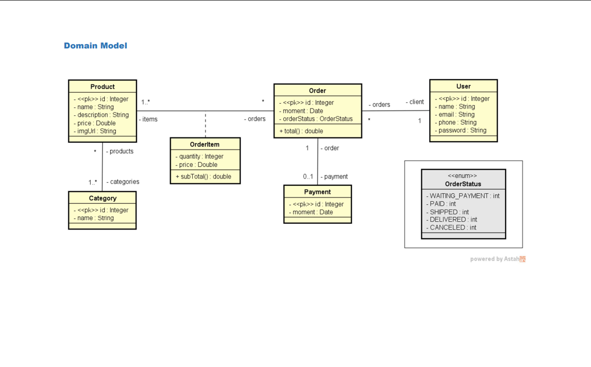
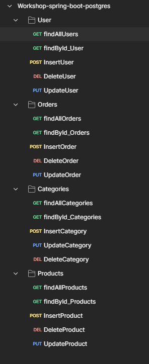

# WorkShop - Sistema de Gerenciamento de Pedidos

Aplicação Spring Boot para gerenciamento de pedidos e-commerce, desenvolvida com arquitetura em camadas e REST API.

## 🚀 Tecnologias

- **Java 21**
- **Spring Boot 3.5.6**
- **Spring Data JPA / Hibernate**
- **PostgreSQL** (desenvolvimento)
- **H2 Database** (teste)
- **Docker & Docker Compose**
- **Maven**

## 📋 Funcionalidades

O sistema gerencia:
- **Usuários**: Cadastro e gerenciamento de clientes
- **Produtos**: Catálogo de produtos com preços e descrições
- **Categorias**: Organização de produtos por categorias
- **Pedidos**: Criação e gerenciamento de pedidos com diferentes status
- **Itens de Pedido**: Relação entre pedidos e produtos com quantidades
- **Pagamentos**: Processamento de pagamentos associados aos pedidos

## 🏗️ Arquitetura

Aplicação estruturada em camadas:

```
├── entities/          # Entidades JPA (User, Product, Category, Order, etc.)
├── repositories/      # Interfaces JPA Repository
├── services/          # Lógica de negócio
├── resources/         # Controllers REST API
└── config/            # Configurações (Dev, Test)
```

## 🗄️ Modelo de Dados

Principais entidades:
- **User**: Clientes do sistema
- **Product**: Produtos do catálogo
- **Category**: Categorias de produtos (relação Many-to-Many)
- **Order**: Pedidos dos clientes com status (WAITING_PAYMENT, PAID, SHIPPED, etc.)
- **OrderItem**: Itens de pedido com quantidade e subtotal
- **Payment**: Pagamentos vinculados aos pedidos

## 🐳 Executando com Docker

1. **Clone o repositório**
```bash
git clone <url-do-repositorio>
cd course
```

2. **Execute com Docker Compose**
```bash
docker-compose up -d
```

A aplicação estará disponível em `http://localhost:8080`

O banco PostgreSQL será iniciado automaticamente na porta `5432`.

## 💻 Executando Localmente

### Pré-requisitos
- Java 21
- Maven 3.6+
- PostgreSQL (ou H2 para teste)

### Configuração

1. **Configure o arquivo `.env`** (se necessário) com variáveis de ambiente:
   - `DB_USERNAME`: Usuário do banco
   - `DB_PASSWORD`: Senha do banco
   - `JWT_SECRET`: Chave secreta JWT
   - `JWT_EXPIRATION`: Tempo de expiração do token

2. **Execute a aplicação**
```bash
mvn spring-boot:run
```

### Perfis

- **dev**: Configuração de desenvolvimento com PostgreSQL
- **test**: Configuração de testes com H2 Database

Para alterar o perfil, edite `application.properties` ou use:
```bash
mvn spring-boot:run -Dspring-boot.run.profiles=test
```

## 📦 Build

Para gerar o JAR executável:
```bash
mvn clean package
```

O arquivo será gerado em `target/course-0.0.1-SNAPSHOT.jar`

## 🔧 Endpoints REST API

### Base URL
```
http://localhost:8080
```

### 📋 Usuários (`/users`)

| Método | Endpoint | Código de Resposta |
|--------|----------|---------------------|
| GET | `/users` | `200 OK` |
| GET | `/users/{id}` | `200 OK` |
| POST | `/users` | `201 Created` |
| PUT | `/users/{id}` | `200 OK` |
| DELETE | `/users/{id}` | `204 No Content` |

### 📦 Produtos (`/products`)

| Método | Endpoint | Código de Resposta |
|--------|----------|---------------------|
| GET | `/products` | `200 OK` |
| GET | `/products/{id}` | `200 OK` |
| POST | `/products` | `201 Created` |
| PUT | `/products/{id}` | `200 OK` |
| DELETE | `/products/{id}` | `204 No Content` |

### 🏷️ Categorias (`/categories`)

| Método | Endpoint | Código de Resposta |
|--------|----------|---------------------|
| GET | `/categories` | `200 OK` |
| GET | `/categories/{id}` | `200 OK` |
| POST | `/categories` | `201 Created` |
| PUT | `/categories/{id}` | `200 OK` |
| DELETE | `/categories/{id}` | `204 No Content` |

### 📝 Pedidos (`/orders`)

| Método | Endpoint | Código de Resposta |
|--------|----------|---------------------|
| GET | `/orders` | `200 OK` |
| GET | `/orders/{id}` | `200 OK` |
| POST | `/orders` | `201 Created` |
| PUT | `/orders/{id}` | `200 OK` |
| DELETE | `/orders/{id}` | `204 No Content` |

### 📊 Status de Pedido (OrderStatus)

| Código | Status           | Descrição              |
|--------|------------------|------------------------|
| 1      | WAITING_PAYMENT  | Aguardando pagamento   |
| 2      | PAID             | Pago                   |
| 3      | SHIPPED          | Enviado                |
| 4      | DELIVERED        | Entregue               |
| 5      | CANCELED         | Cancelado              |

## 📝 Estrutura do Projeto

```
course/
├── src/
│   ├── main/
│   │   ├── java/com/spring/course/
│   │   │   ├── entities/        # Entidades JPA
│   │   │   ├── repositories/    # Repositórios
│   │   │   ├── services/        # Serviços de negócio
│   │   │   ├── resources/       # Controllers REST
│   │   │   └── config/          # Configurações
│   │   └── resources/
│   │       ├── application.properties
│   │       ├── application-dev.properties
│   │       └── application-test.properties
│   └── test/                    # Testes unitários
├── docker-compose.yml
├── Dockerfile
└── pom.xml
```

## 🛠️ Tratamento de Exceções

O sistema possui tratamento global de exceções através de `ResourceExceptionHandler`, com suporte para:
- `ResourceNotFoundException`: Recursos não encontrados
- `DatabaseException`: Erros de banco de dados

## Relacionamento



## Postman


